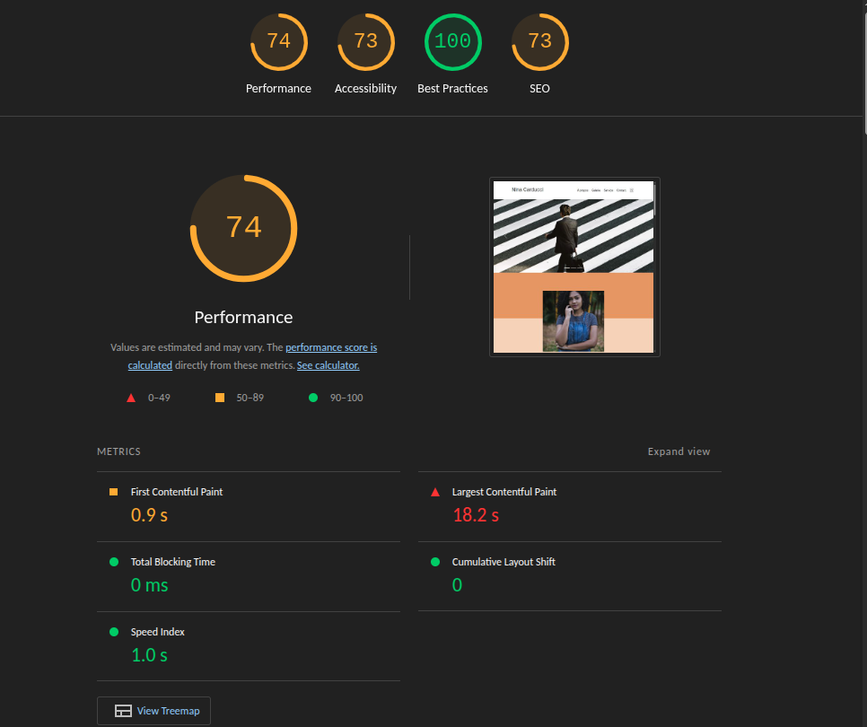

# 🛠️ Liste complète des modifications

Ce document répertorie l'ensemble des optimisations et corrections apportées au projet, classées par thématiques.

## 💻 Bugs JavaScript
- [x] **Filtre galerie** : Ajout de la classe `active` sur le filtre sélectionné pour un retour visuel utilisateur.
- [x] **Navigation modale** : Correction de la logique d'incrémentation (index `i-1` / `i+1`) pour la navigation *précédent/suivant*.

## 🔍 SEO (Référencement Naturel)
- [x] Ajout de l'attribut `lang="fr"` sur la balise `<html>`.
- [x] Optimisation du `<head>` : déplacement de la balise `<meta charset>` en première position.
- [x] Ajout d'un `<title>` unique et pertinent.
- [x] Ajout d'une balise `<meta name="description">`.
- [ ] **[En cours]** Correction de la hiérarchie des titres (`h1` à `h6`).
- [ ] Mise en place des balises **OpenGraph** (pour le partage Facebook/LinkedIn).
- [ ] Configuration des **Twitter Cards**.
- [ ] Implémentation des données structurées **Schema.org** (SEO local).

## 🚀 Performance
- [x] **Format WebP** : Compression et conversion de toutes les images pour réduire le temps de chargement.
- [x] **Responsive Images** : Redimensionnement des assets à leur taille d'affichage réelle.
- [x] **Scripts** : Ajout de l'attribut `defer` sur toutes les balises `<script>`.
- [ ] Optimisation du rendu : Ajout de `loading="lazy"` sur les images hors écran (Lazy Loading).
- [ ] Prévention du Layout Shift (CLS) : Ajout systématique des attributs `width` et `height`.

## ♿ Accessibilité & Sémantique
- [x] Ajout d'attributs `alt` descriptifs sur toutes les images.
- [x] Liaison des `<label>` aux `<input>` via les attributs `for="id"`.
- [x] Amélioration de la navigation clavier : ajout d'un `aria-label` sur le lien Instagram.
- [ ] **[En cours]** Restructuration sémantique : utilisation des balises `<header>`, `<main>`, `<nav>`, et `<section>`.
- [ ] Correction des contrastes de couleurs pour respecter les normes WCAG.
- [ ] Ajout d'un landmark `<main>` pour faciliter la navigation par lecteur d'écran.

