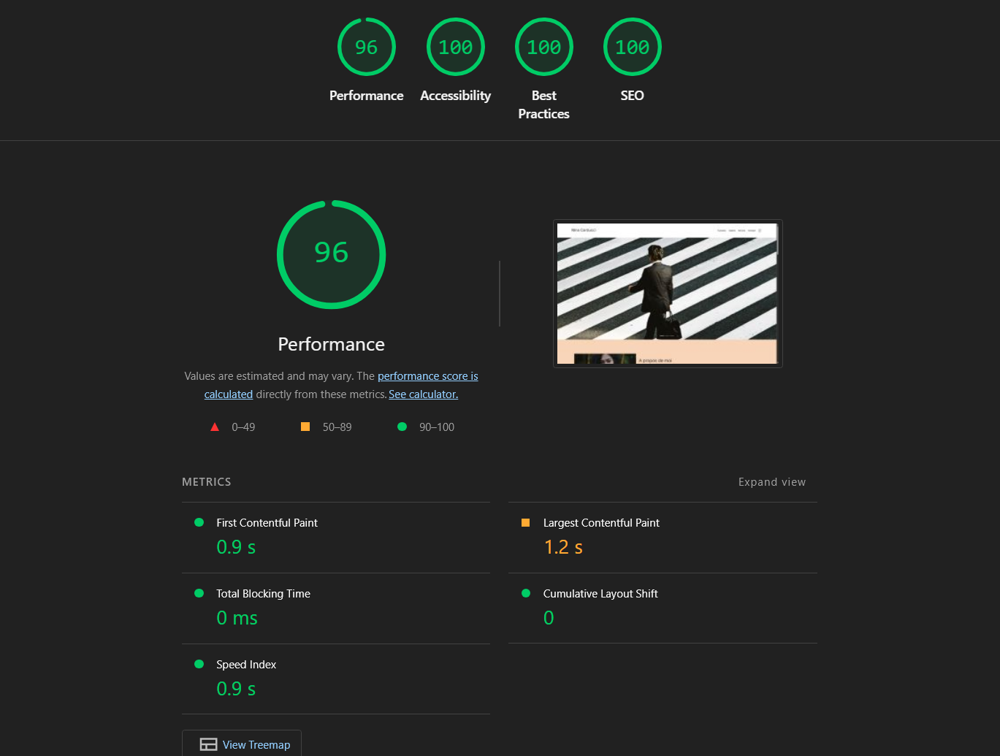
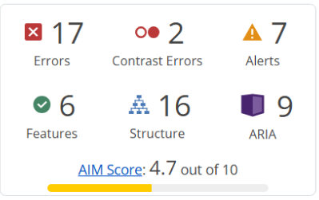
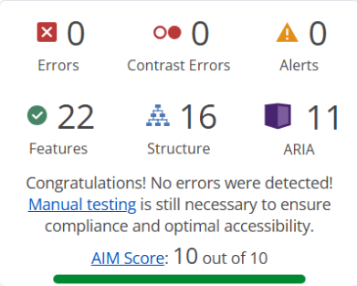

# Rapport d'intervention — Nina Carducci

## I - Score Lighthouse

### Avant optimisation
| Axe | Score |
|-----|-------|
| Performance | 74 |
| Accessibilité | 67 |
| Best Practices | 100 |
| SEO | 73 |

[]

### Après optimisation
| Axe | Score |
|-----|-------|
| Performance | 95 |
| Accessibilité | 92 |
| Best Practices | 100 |
| SEO | 100 |

[]

## II - Détails des optimisations effectuées

### 1 - Les images

Le projet comportait originellement 14 images pour un poids total 
d'environ 30 000 Ko (30 Mo). Nous avons effectué les modifications 
suivantes :

- Conversion de toutes les images au format WebP
- Redimensionnement des images à leur taille d'affichage réelle
- Ajout de l'attribut loading="lazy" sur les images hors écran

Après modifications, le poids total des images est d'environ 580 Ko,
soit un gain de plus de 98%.

### 2 - Les scripts

- Ajout de l'attribut `defer` sur tous les scripts pour supprimer
  le blocage du rendu de la page

### 3 - Sémantique HTML

- Remplacement des `
` génériques par des balises sémantiques :
  `<header>`, `<main>`, `<nav>`, `<section>`
- Correction de la hiérarchie des titres (h1 → h2 → h3)
- Remplacement des `<h1>` sur les citations par des `
`
- Remplacement du `<h6>` introduction par un `
`

### 4 - SEO

- Ajout de `lang="fr"` sur la balise `<html>`
- Déplacement de `<meta charset>` en première position du `<head>`
- Ajout d'un `<title>` descriptif
- Ajout d'une `<meta description>`
- Ajout des balises OpenGraph pour le partage sur Facebook/LinkedIn
- Ajout des Twitter Cards pour le partage sur Twitter/X
- Implémentation de Schema.org (LocalBusiness) pour le SEO local

### 5 - Accessibilité

- Ajout d'attributs `alt` descriptifs sur toutes les images
- Liaison des `<label>` aux `<input>` via l'attribut `for`
- Ajout d'un `aria-label` sur le lien Instagram
- Correction des contrastes de couleurs

## III - Accessibilité du site

### Avant optimisation
- Score Lighthouse accessibilité : 73
- Nombreuses erreurs WAVE détectées

[]

### Après optimisation
- Score Lighthouse accessibilité : 100
- 0 erreur WAVE détectée
- AIM Score : 10/10

[]

### Modifications effectuées

- Ajout des attributs `alt` sur toutes les images du site
- Liaison des `<label>` aux `<input>` du formulaire via `for="id"`
- Ajout d'un `aria-label` sur le lien Instagram (lien sans texte visible)
- Correction de la hiérarchie des titres pour une navigation 
  logique au lecteur d'écran
- Ajout des balises sémantiques `<header>`, `<main>`, `<nav>`, 
  `<section>` pour faciliter la navigation assistée
- Ajout de `lang="fr"` sur `<html>` pour une lecture correcte 
  par les lecteurs d'écran